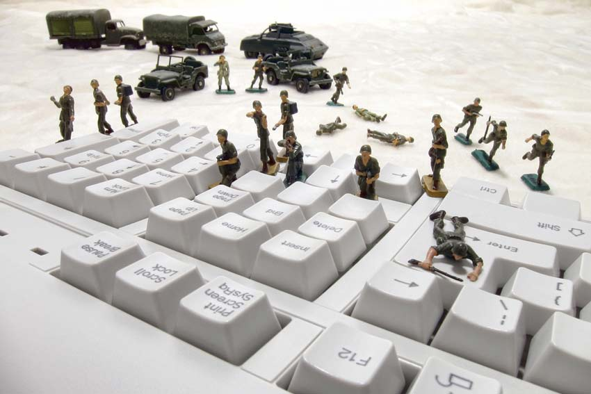

This year we saw [a number cyber attacks like WannaCry and Petya](https://lambdasec.github.io/Is-the-World-Ready-for-the-New-Generation-of-Self-Propagating-Ransomware/) aimed at causing disruptions and damage to organizations and nations. In this article, we take a look at what is in store for us in 2018.  

## Will there be information/cyber conflicts in 2018?
Certainly, there are likely to be two major themes in cyber conflict in 2018. Firstly, we may see North Korea increase their cyber attacks potentially with influence from Russia. They are likely to infiltrate and disrupt US critical infrastructure for cyber espionage. Secondly, China is likely to continue it's cyber warfare activities despite the Xi Agreement with the US government. They will target high profile cases selectively and ensure that diplomatic blowback is limited. 

## What will be the impetus for these conflicts?
Cyber conflicts in 2018 are going to be driven in retaliation of US-led economic sanctions. We have seen in the past as well that nations like Iran and North Korea respond to newly imposed trade and economic sanctions with cyber attacks targeting U.S. companies. Another major force for cyber attacks is going to be the political motivation to interfere with the internal affairs of another nation. We saw this last year with Russia launching a major campaign of misinformation and disruption during the US presidential elections.

## How will they be quelled?
We will see more cooperation and collaboration among major cyber powers and increased sharing of tools, techniques and intelligence to manage the growing threat of cyber attacks. Among the smaller countries we are likely to see them seek more control over their internal media and information systems. They are also going to buy more equipment and implement best practices from other major cyber powers to manage their domestic security goals.
