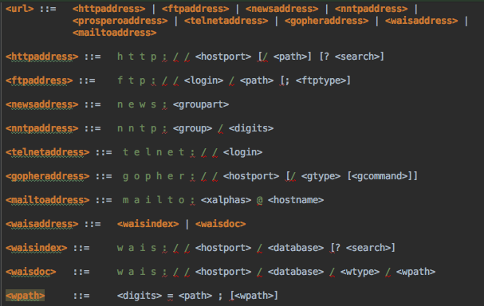

GramTest is a Java-based tool that allows you to generate random test cases based on BNF grammars. It is an open-source project and can be downloaded from [GitHub](https://github.com/codelion/gramtest). In this article, we will see how you can use GramTest to generate continuous tests that can in-turn be used to fuzz Java libraries and applications.



As an example we will use the grammar for URLs as defined in [rfc1738](https://tools.ietf.org/html/rfc1738). Part of the grammar is shown above and as you can see, it if fairly complex. If you directly run GramTest from command line using this grammar as input you will get some interesting test cases:

```
Generating tests ...
mailto:5ol@S*7
prospero://E:4/%Dd
http://c7
nntp:N.p/00
telnet://
news:O2
ftp://+n@aF5:21/
wais://B.U/*u/,4_/82=;
gopher://T53
```

This is good for test case generation but not ideal if you want to run a long fuzzing session with some library or application. For doing continuous fuzzing you can use GramTest as a library very easily. The [`TestRunner`](https://github.com/codelion/gramtest/blob/master/src/main/java/com/sourceclear/gramtest/TestRunner.java) class provided in GramTest makes it easy to integrate with any application for fuzzing. You can even implement it as part of a test case:

```
  /**
   * Test with url grammar
   * @throws java.io.IOException
   */
  @Test
  @Ignore("Non terminating test case")
  public void testQueueGenerator() throws IOException, InterruptedException {
    final BlockingQueue<String> queue = new SynchronousQueue<>();
    TestRunner continuousRunner = new TestRunner(getClass().getResourceAsStream("/url.bnf"), queue, 10, 8, 32);
    new Thread(continuousRunner).start();
    consumeTests(queue);
  }

  private void consumeTests(BlockingQueue queue) throws InterruptedException {
    while(true) {
      String testCase = (String) queue.take();
      try {
        URL.parse(testCase);
      } catch (URLParseException e) {
        System.out.println(testCase);
      }
    }
  }
```

Just pass the BNF grammar file as  input and a `BlockingQueue` to read the generated tests. The queue just makes it easy to add multiple consumers that can each run in their own thread in parallel. This will allow you to run long fuzzing sessions against a target Java library or application. In fact with this exact set up and the given URL input grammar, GramTest found [a bug](https://issues.apache.org/jira/browse/VALIDATOR-410) in the Apache Commons URL validator. 

If you use GramTest and find new bugs using it, please let us know. Until next time, happy fuzzing!
