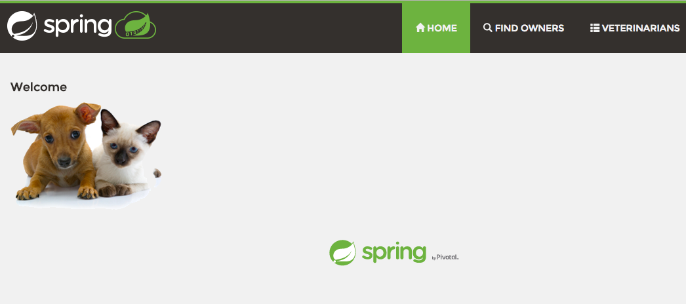
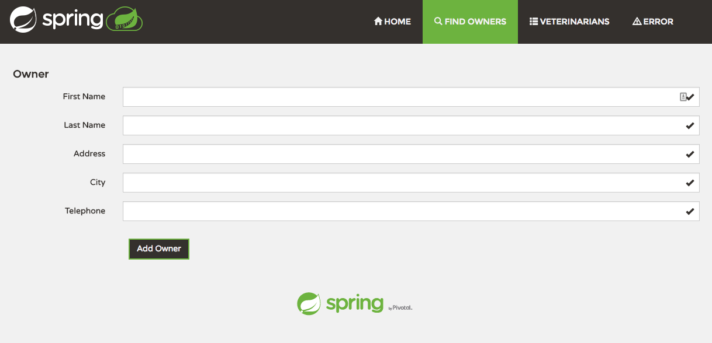
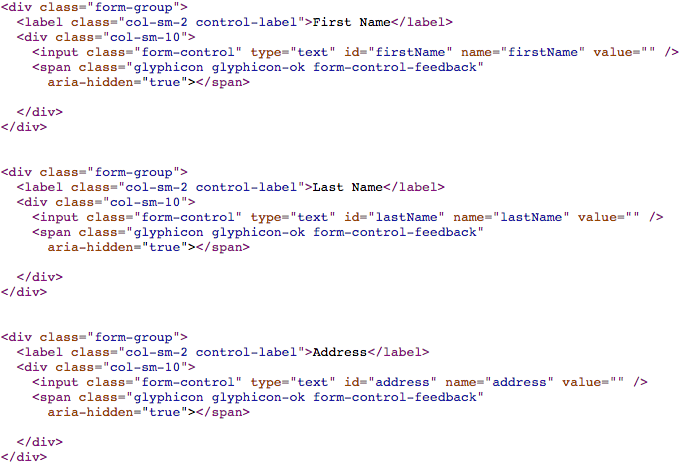
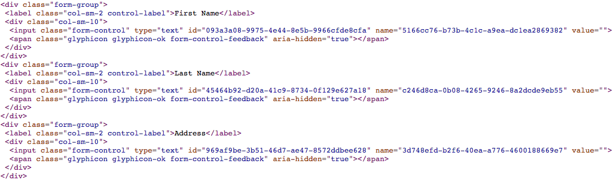

[Botwall4J](https://github.com/lambdasec/botwall4j) is an open-source library that can help protect Java web applications from bots, content scrapers and automated account hijacking attempts. In this article, we will see how simple it is to integrate botwall4j with a Spring Boot application and get protection from bots without any code changes.



We will use the Spring Boot pet clinic app as an example in this article. The [Spring Pet Clinic](https://github.com/spring-projects/spring-petclinic) is a sample application released by Pivotal to show typical features of Spring Boot. There are several variations and forks of the application available which you can check on on their [GitHub](https://github.com/spring-projects/spring-petclinic#interesting-spring-petclinic-branches-and-forks) page. We have used the canonical implementation that is based on Spring Boot and Thymeleaf.

Once you build and run the application you will see a website for a Pet Clinic, it has several pages and forms. One of them is the form for adding owners (`http://localhost:8080/owners/new`):



This form (and other pages on the site) can be used by bots to automatically submit fake data or do content scraping. Botwall4J makes it harder for bots to attack your website without the need for installing captchas everywhere. It is implemented a a servlet filter so in order to use it, we just include the botwall4j library in the application and define a new bean in the `PetClinicApplication` class:

```java
@SpringBootApplication
public class PetClinicApplication {

    public static void main(String[] args) throws Exception {
        SpringApplication.run(PetClinicApplication.class, args);
    }

    @Bean
    public FilterRegistrationBean responseHardeningFilterRegistrationBean() {
        final FilterRegistrationBean filterRegBean = new FilterRegistrationBean();
        filterRegBean.setFilter(new ResponseHardening());
        filterRegBean.setEnabled(true);
        filterRegBean.setOrder(Integer.MIN_VALUE);
        return filterRegBean;
    }
}
```
Before using the `ResponseHardening` filter from botwall4j, the source code of the add owner page contains the following `form` element:



After adding the filter and running the application again if you check out the source code you will see that all the `id` and `name` fields have been scrambled:



Every time you reload the page the generated `id` and `name` would be different, this enables a [moving target defense](https://www.dhs.gov/science-and-technology/csd-mtd) against bots that are trying to attack your web application. You can also control which URLs to protect in your application by using the `setUrlPatterns` method in the `FilterRegistrationBean` class. 

Thus, botwall4j provides an easy way to add more protection to your Spring Boot application without any major code changes. Do [check it out](https://github.com/lambdasec/botwall4j), and let us know if you have any further questions!
