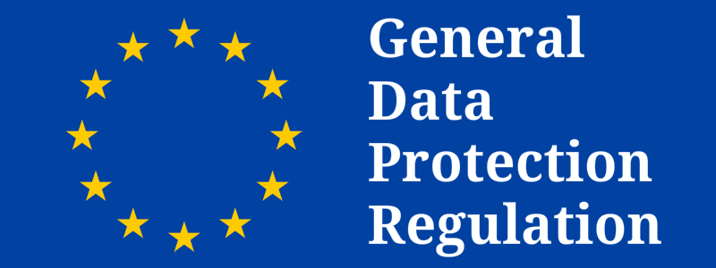

On 25th May 2018 the [EU General Data Protection Regulation (GDPR)](https://en.wikipedia.org/wiki/General_Data_Protection_Regulation) will become enforceable. It will change how businesses and public sector organizations can handle information of customers and users. GDPR is Europe's new framework for data protection laws and replaces existing data protection directive. The full text of the regulation can be found [here](http://ec.europa.eu/justice/data-protection/reform/files/regulation_oj_en.pdf). In this article, we will cover five basic steps an organization can take in order to ensure GDPR compliance.

  

## 1) Does it apply to you?

If you are a company outside EU that processes personal data about persons who are in EU, then you will need to comply with GDPR. In fact you are required to appoint an EU representative in an appropriate EU country such that the compliance towards GDPR can be shown. You may appoint a representative in a member state whose personal data is used for collection and processing by your business. It is important to identify the country for jurisdiction and legal purposes. 

The GDPR includes a ‘one-stop-shop’ provision which will assist those organizations which operate in many EU member states. Multinational organizations will be entitled to deal with one Data Protection Authority, referred to as a Lead Supervisory Authority (LSA) as their single regulating body in the country where they are mainly established. That Data Protection Authority will then become the LSA when regulating all data protection matters involving that organization, although it will be obliged to consult with other concerned Data Protection Authorities which are concerned in relation to certain matters.

In general the main establishment of an organization is determined according to where the organization has its main administration, or where decisions about data processing are made. However, it would be helpful for you to map out where your organization makes its most significant decisions about data processing, as this will help to determine your main establishment and therefore your LSA.

Most US based startups tend to set up their Europe offices in Dublin or Amsterdam so the LSA would be either Ireland or Netherlands. There are very limited exceptions for GDPR meant for public bodies or when the processing of data is occasional.

## 2) How to implement GDPR controls in an organization?

GDPR compliance will require across the board support within an organization. Senior stakeholders must be identified to support the data protection compliance program. Whereas previously the appointment of a data protection officer
(a DPO) was optional in most Member States, controllers and
processors are now obliged to appoint a DPO in certain
circumstances, including: (a) where the core activities of the
organization consist of processing operations which require
“regular and systematic monitoring” of data subjects on “a large
scale”; or (b) where the core activities consist of processing of
special categories of data on a “large scale”; or (c) where required
under Member State law.

The DPO should report to the highest management level of the
controller or processor (as appropriate) and must be supported in
carrying out its functions, including with the necessary resources
The DPO’s contact details must be notified to the Supervisory
Authority so that he/she will be the first official contact point on any
issues

Organizations should adopt internal policies and implement technical and organizational
measures:

- relating to pseudonymization, data subject transparency and access
- which provide that only personal data which is necessary for each specific purpose of the
processing is processed (in particular in relation to the amount of data collected, the extent
of its processing, the period of its storage and its accessibility)
- which provide that personal data is not made accessible to more individuals than necessary
for the purpose
- using applications or processes which allow them to implement such controls and (where
available) have been certified by a body accredited by a Supervisory Authority may become
a way of demonstrating compliance with the privacy by design requirements

## 3) Restrictions on export of personal data?

The export restrictions on personal data are broadly unchanged under GDPR however the process has been streamlined a bit. Organizations need to map international data flows and ensure that the export obligations are passed down to subcontractors and vendors. You should also consider what existing data transfer mechanisms are in place and whether these
continue to be appropriate. Countries that are currently white listed (Andorra, Argentina, Canada, Switzerland, Faeroe
Islands, Guernsey, Israel, Isle of Man, Jersey, Uruguay and New Zealand) remain so until a
Commission review finds otherwise. Failure to comply with the export rules can attract the highest
4% of worldwide turnover fines under GDPR.

## 4) How to process personal data?

GDPR includes new limitations on the use of consent as a ground for processing personal data. Organizations need to ensure that consent is used only when that is the only way to justify processing of the data. If the consent is made under condition of receipt of a service, then organizations must document it appropriately. In addition GDPR also grants your customers/users the following rights:

- to have personal data exported in a commonly used machine readable
format (data portability)
- to erase personal data in certain
circumstances and where the data has been made public to
take reasonable steps to inform companies that are processing
the data that the user has requested its erasure of any
links to, copies or replication of it (right to be forgotten)
- to more information about a company’s data processing controls (export
solution, storage limits) through a subject access request and
to provide the information in a commonly used electronic form
- to require data to be marked as restricted whilst complaints
are resolved

Your data processing workflow needs to be redesigned in order to enable the above rights for your users and customers. 

## 5) How to handle personal data breach?

The new breach notification law provides for a 72 hour deadline in
respect of notifications to the relevant Supervisory Authority and a
requirement to provide notifications to data subjects “without
undue delay” in certain high risk circumstances
They also require organizations to maintain a personal data
breach register.

## Solutions for GDPR compliance

Even though a lot of companies are selling commercial products and solutions geared towards making businesses GDPR complaint, you need to realize that just buying a product is not going to help. Ensuring GDPR compliance will require major organizational and process changes within the company. The best place to start the process is to identify different types of data that is collected in the company and prepare a data inventory. Then you can identify owners and map the flow of data across the enterprise. Having visibility into the type of data is important as you want to ensure that sensitive personal data is protected.