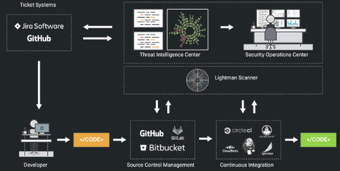
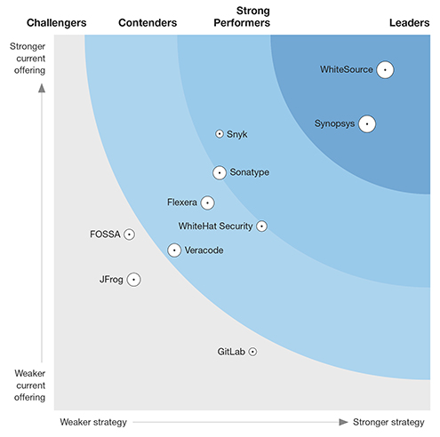

Recently, I have been thinking a lot about product commoditization and how it affects the software composition analysis (SCA) tools market. If you have been living under a rock and have never heard of SCA you can read a general overview of the problem and solution space [here](https://www.veracode.com/products/software-composition-analysis). 

The key insight behind SCA is that, now-a-days developers assemble large applications using off-the-shelf open-source components and libraries, which are distributed through centralized repositories such as Maven Central, NPM, RubyGems, and PyPI. Much of the busywork of downloading sources and negotiating package versions is automated by dependency management tools like npm, pip, or gem. A single install command can pull in hundreds of libraries, demonstrating how easily large volumes of third-party code can be included in software projects. Obviously, there are many benefits to using open-source libraries: low cost, code reuse, and the flexibility to customize it to one’s needs. 

However, reusable third-party code is also a means for flaws and vulnerabilities to make their way downstream into applications. Vulnerabilities like – [Heartbleed](https://en.wikipedia.org/wiki/Heartbleed), [FREAK SSL/TLS](https://en.wikipedia.org/wiki/FREAK), and [GHOST](https://blog.qualys.com/laws-of-vulnerabilities/2015/01/27/the-ghost-vulnerability) – were due to bugs in popular open-source libraries. The 2017 [Equifax data breach](https://en.wikipedia.org/wiki/Equifax#May%E2%80%93July_2017_data_breach), the largest in history, was also due to a known vulnerability in the Apache Struts web framework.

Now, when I started work at [SourceClear](https://en.wikipedia.org/wiki/SourceClear) back in 2014, the term SCA didn't really exist and really the only big company entering this space was [BlackDuck](https://www.blackducksoftware.com/).  And today, this space is very crowded with a number of competitors and in the last couple of years there has been a lot of consolidation with M&A activity (including SourceClear's purchase by Veracode). To give you an idea of the players in this market you can take a look at the recent Forrester Wave for SCA below:

As the SCA product and market has matured we are now slowly heading in the territory where all the players have similar features and capabilities.  Unfortunately,  some of this is inevitable as technology products have a tendency to get [commoditized]((https://hbswk.hbs.edu/item/when-your-product-becomes-a-commodity)).  In fact, lower barrier of entry, use of cloud-based services and increased popularity of open-source components, may even be accelerating high tech commoditization in software products.  This has already happened in manufacturing as described in the article on [Why High-Tech Commoditization Is Accelerating](https://sloanreview.mit.edu/article/why-high-tech-commoditization-is-accelerating/):

>Knowledge embedded within state-of-the-art production and design tools is a powerful force that is leveling the global technology playing field. It democratizes innovation and makes future competition ever more challenging.

And something very similar has been happening in the business of software. It has never been easier to design and build complex products and bring them to market quickly. Once a product reaches maturity in terms of market fit and all the competitors have enough resources it becomes very hard to differentiate. New features or unique capabilities can be implemented by all the players in the market relatively easily. This puts even more pressure on everyone to copy each other and the product road-maps of all the major companies start to converge. Peter Ducker summed it up nicely when he said:

> "In a commodity market, you can only be as good as your dumbest competitor." 

As all the major players in SCA market (such as Synopsys, Veracode, WhiteSource, Snyk and others) now offer similar features w.r.t open-source component identification, vulnerability detection, security alerts and reporting, it is obvious that we are heading towards product commoditization. The current environment makes it much harder to create and sustain differentiation in a SCA product. 

There are couple of things we can do to resist commoditization. Firstly, we can package the product with a differentiated customer support and professional services offering. This will appeal to large enterprise customers as they are looking for convenience and end-to-end services. Or, we can try and find a different market segment where the product is still important to customers either due to less price sensitivity or specific regulatory requirements. 

As an example for the SCA market, we see that Veracode provides a platform with professional and consulting services to enable enterprises to manage their entire application security program with a single vendor.  On the other hand, BlackDuck offering from Synposys is well suited for a customer in the middle of an M&A where they may not be as price sensitive and will need to use the tool for diligence around licensing risks (which is the prime focus of the BlackDuck product). 

Packaging and segmenting can only help slow down the commoditization process, but are not going to prevent it. The only way out of it is to innovate at all costs. Unfortunately, as the products from incumbents get mature it becomes harder and harder for them to innovate. This usually presents itself as an opportunity for startups to disrupt the incumbents and the so the cycle goes. The main problem for a larger company is not that someone else will build a better version of their product, but that someone will build a new product that will make their solution irrelevant. 

Coming back to the problem of managing open-source risk and the current offerings in the SCA market, it is hard to imagine what the future will look like. We can look at the past though and recently I was going through the [original research memo](http://asankhaya.github.io/pdf/Research-Statement.PDF) I wrote at SourceClear back in 2014. Several of the key features of our product and those of our competitors can trace their origins to the interesting problems and questions outlined in the memo. The SCA product from SourceClear was highly differentiated because we were the first to [use machine learning for vulnerability identification](https://dl.acm.org/citation.cfm?id=3117771), [design a domain specific language for large scale program analysis](https://doi.org/10.1109/SecDev.2018.00016) and [build a static analysis for automated remediation](https://doi.org/10.1145/3236024.3275535).  

As everyone knows, past performance is no guarantee of future returns. After all, it is possible that we just got lucky or the fact that were not as successful commercially as some of our other competitors must mean that there are things we could have done better. However, you miss 100% of the shots you don't take. So, in the spirit of taking a few shots at the future, here are some of the areas I think that are going to be interesting for the SCA product :

 ## Beyond vulnerabilities and license risks  

Today the SCA products only seem to tackle the problems with license and security issues when using open-source components. But what are the other things Developers care about when they use open-source components? How do they  choose the right library for a given task? Or, how do they figure out the correct use of a library or component API?  

 ## Beyond CI/CD integration

The ability to shift left in the development process and integrate directly with the CI/CD pipeline has been critical for current SCA products to get high user adoption. Is it possible to move even earlier in the process? Can we present meaningful information to developers when they are adding an open-source library to their application? Following correct by construction approaches, can we publish a verified (or bug-free) central repository of components that can be used by any dependency management system?
 
## Beyond component scanning

As the number of components and libraries in an average application keeps increasing where does it end. If we are building software in a world where every module is either an internal library or an open-source component, how do we ensure the security of the overall application? Do existing approaches for static or dynamic application testing make sense in such a world? Or, is it "good enough" to just identify vulnerabilities in components and ensure that they are put together in a "correct" way using their APIs?

## Beyond data analytics and reporting 

Today, a large enterprise customer has to deal with a number of tools and processes when implementing their application security program. Can we use machine learning and AI to connect people, process, and tools involved in application security testing to provide visibility, control and proactive remediation? Modern agile software development process and best practices create a lot of data which resides in source control management, bug reports, CI/CD pipelines, logging and monitoring tools etc. and yet all this is essentially ignored by the application security tools today. As the tools integrates more closely with the development workflow and touch points, there is a great opportunity to mine software repositories to provide better security and productivity to developers.

If you have read through till the end, hopefully by now you understand some of the challenges that are faced by SCA vendors as the market matures and some future directions on how they can avoid the fate of commoditization. As to how well we do at this, I suggest you check back here again in a few years time!

