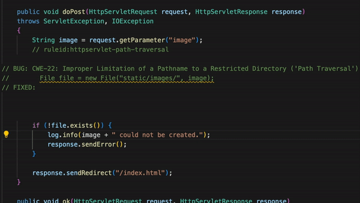
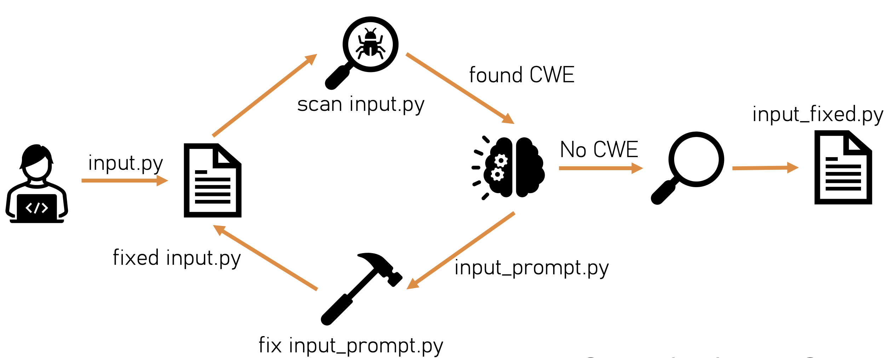

In the rapidly evolving world of software development, security remains a paramount concern. With the increasing complexity of applications and the ever-present threat of cyber attacks, developers and security teams are in a constant race to identify and fix vulnerabilities. This is where AutoFix, a groundbreaking tool, enters the picture.


[AutoFix](https://github.com/lambdasec/autofix) is not just another vulnerability scanner; it's a sophisticated blend of static analysis and Large Language Models (LLMs) designed to automatically detect and remediate software vulnerabilities. By leveraging the capabilities of existing static analyzers, like Semgrep, and code LLMs, such as Starcoder, AutoFix offers a unique approach to securing software applications.

The key to AutoFix's effectiveness lies in its methodology. Unlike traditional tools that solely identify issues, AutoFix goes a step further. It uses the insights from static analysis as a guide to craft specific prompts for the LLM, leading to tailored fixes for identified vulnerabilities. This synergy between static analysis and AI not only enhances accuracy but also speeds up the remediation process, a critical factor in today's fast-paced development cycles.

As we delve deeper into this blog post, we will explore the nuances of AutoFix, its setup, and its operational workflow.

### Background

#### Bridging the Gap in Software Security: The Evolution of Static Analysis and AI

The landscape of software development has always been dynamic, with security challenges evolving alongside technological advancements. Two key players in this field are static analysis and Large Language Models (LLMs), each playing a pivotal role in shaping modern software security practices.

**Static Analysis: The First Line of Defense**

Static analysis has been a cornerstone in software development for decades. It involves analyzing source code without executing it, aiming to uncover potential vulnerabilities, coding errors, and quality issues. Tools like Semgrep have made significant strides in this area, offering developers a way to scan their codebases for known patterns of issues. However, while static analysis excels at identifying problems, it often stops short of offering concrete solutions for remediation.

**The Rise of Large Language Models in Code Generation**

Enter Large Language Models, a revolutionary force in the field of artificial intelligence. LLMs like Starcoder have transformed the way developers approach coding challenges. These models are trained on vast datasets, enabling them to generate code, suggest solutions, and even fix bugs. However, without a precise focus, their potential in security remediation has remained largely untapped.

**The Missing Link: A Synergistic Approach**

This is where the gap in traditional methodologies becomes evident. Static analysis provides a precise diagnosis of issues, while LLMs hold the key to innovative solutions. But without a bridge connecting these two, their full potential in enhancing software security remains unrealized.

### Introducing AutoFix

#### Revolutionizing Vulnerability Remediation with the Power of AI and Static Analysis

In a world where software security is more crucial than ever, AutoFix emerges as a beacon of innovation. This tool is not just an advancement; it's a revolution in the way we approach software vulnerabilities. Here, we introduce the core concept of AutoFix and how it stands apart in the realm of automated security solutions.

**The Essence of AutoFix**

At its heart, AutoFix is a unique amalgamation of static analysis tools and Large Language Models (LLMs). It is designed to automatically detect and fix vulnerabilities in software code. By integrating renowned static analyzers like Semgrep with advanced code LLMs such as Starcoder, AutoFix elevates the standard process of vulnerability remediation to new heights.

**How AutoFix Stands Out**

Unlike traditional tools that only identify issues, AutoFix actively participates in the remediation process. It uses the output from static analyzers not just as a report but as a guide. This information is then used to craft precise prompts for LLMs, resulting in customized and effective fixes for the identified vulnerabilities.



The true innovation of AutoFix lies in its iterative process. Once a potential fix is generated, the tool re-scans the code to ensure the vulnerability has been adequately addressed. If not, AutoFix repeats the process, refining the prompts and solutions until the issue is resolved or it reaches a maximum number of attempts. This iterative approach ensures a thorough and effective remediation process.

**A New Era in Software Security**

AutoFix represents a significant leap forward in automated security solutions. By intelligently combining the diagnostic prowess of static analysis with the problem-solving capabilities of LLMs, AutoFix is poised to set a new standard in software security.

### Setting Up AutoFix

#### A Step-by-Step Guide to Implementing Advanced Security Measures

Implementing AutoFix in your software development workflow is straightforward and efficient. In this section, we'll guide you through the process of setting up AutoFix, ensuring that you can start enhancing your software's security with minimal effort.

**1. Preparing Your Environment**

The first step in utilizing AutoFix is to prepare your development environment. This involves setting up a virtual environment, which helps in managing dependencies and keeping your project isolated from other Python projects on your system. Here's how you can set it up:

```
python3 -m venv .venv
source .venv/bin/activate
```

This command creates a new virtual environment named `.venv` and activates it. 

**2. Installing Dependencies**

With your environment ready, the next step is to install the necessary dependencies. AutoFix comes with a `requirements.txt` file that lists all the packages needed for it to run effectively. Install them using the following command:

```
pip install -r requirements.txt
```

This step ensures that all the required libraries, including those for static analysis and interfacing with the LLM, are correctly installed.

**3. Running AutoFix**

Now that your environment is set up and dependencies are installed, you're ready to run AutoFix. You can do this by providing an input file for AutoFix to analyze and remediate. For instance, to run AutoFix on a sample Java file:

```
python autofix.py --input examples/example.java
```

This command initiates the AutoFix process, where it first analyzes the provided Java file using the integrated static analyzer, then crafts prompts for the LLM based on the analysis, and attempts to remediate any identified vulnerabilities.

**Ready to Secure Your Code**

With these simple steps, AutoFix is now an integral part of your software development toolkit, ready to enhance the security of your applications with its advanced vulnerability detection and remediation capabilities.

### The AutoFix Workflow

#### Innovating Software Security Through AI-Driven Remediation

AutoFix represents a paradigm shift in how software vulnerabilities are addressed. This section delves into the intricacies of the AutoFix workflow, illustrating how it seamlessly blends static analysis with the prowess of Large Language Models (LLMs) to create a powerful tool for software security.



**1. Initial Vulnerability Detection**

The process begins with AutoFix scanning the target code using its integrated static analysis tools, like Semgrep. This step is crucial as it identifies potential vulnerabilities, code quality issues, and security flaws without executing the code. The output from this phase serves as the foundation for the subsequent steps.

**2. Crafting LLM Prompts**

Based on the results of the static analysis, AutoFix crafts targeted prompts for a code LLM, such as Starcoder. These prompts are designed to be specific to the identified vulnerabilities, guiding the LLM towards generating appropriate and effective fixes.

**3. The Iterative Remediation Loop**

Once the LLM generates a potential fix, AutoFix doesn't stop there. It re-analyzes the code with the proposed fix to ensure the vulnerability has been adequately addressed. If the issue persists, AutoFix iterates through this process, refining the prompts and solutions until a satisfactory fix is applied or it reaches a preset maximum number of attempts (default is 10).

**4. Validating and Finalizing Fixes**

The final step is the validation of fixes. AutoFix ensures that the applied solutions do not introduce new vulnerabilities or degrade the code quality. This comprehensive approach guarantees not just a quick fix but a robust and secure solution.

**A Continuous Cycle of Learning and Improvement**

What sets AutoFix apart is its ability to learn from each iteration. This continuous learning process enhances its efficiency and effectiveness, making it a dynamic tool that evolves with the changing landscape of software security.

With AutoFix, developers and security teams can significantly reduce the time and effort required to secure their code, allowing them to focus on other critical aspects of software development.

#### Embracing the Future of Software Security with AutoFix

As we reach the end of our exploration into AutoFix, it's clear that this tool is not just a technological advancement; it's a transformative force in the realm of software security. AutoFix, with its innovative combination of static analysis and Large Language Models (LLMs), represents a new era in the way we address software vulnerabilities.

**The Pioneering Impact of AutoFix**

AutoFix has demonstrated its capability to significantly reduce the time and effort required to secure codebases. By automating the detection and remediation of vulnerabilities, it has allowed developers and security teams to focus on other critical aspects of software development, enhancing overall productivity and security posture.

**A Community-Driven Future**

The journey of AutoFix doesn't end here. Its effectiveness and efficiency will continue to grow, fueled by the feedback and contributions from its community of users. We invite developers, security professionals, and enthusiasts to join us in this journey, contributing to the [AutoFix project on GitHub](https://github.com/lambdasec/autofix) and helping shape the future of automated software security.

**A Step Towards a More Secure Digital World**

In conclusion, AutoFix stands as a beacon of hope in a landscape often marred by security challenges. Its ability to adapt, learn, and evolve positions it as a crucial tool in our collective quest for a more secure digital world.