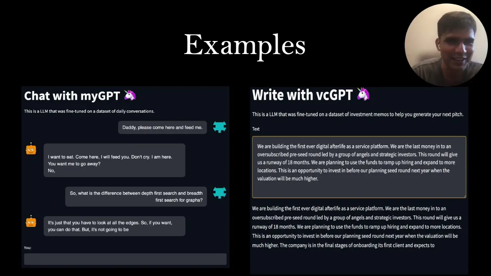

## The Genesis of Digital Immortality
In an era where our digital footprints are as expansive as the internet itself, the concept of digital immortality is not just science fiction but a burgeoning reality. The introduction of (meraGPT)[https://meraGPT.com], the world's first digital afterlife as a service platform, represents not only a leap towards this future but also a reflection on humanity's long-standing desire to leave a mark beyond their physical existence.

From the cave paintings of our prehistoric ancestors to the vast digital landscapes we navigate today, the urge to preserve our legacy has always been a part of us. And now, with the advent of large language models (LLMs) and other advanced technologies, we stand on the brink of making the concept of digital afterlife a tangible experience.

## The Role of Large Language Models in Preserving Legacies
LLMs have reached a point where they can understand and generate language as effectively as humans. When combined with multimedia technologies capable of creating deep fakes, virtual reality, and augmented reality, these models can recreate individuals who have passed away in a manner that's astonishingly lifelike.

Imagine a future where you could interact with a holographic projection of a loved one, powered by a massive database of their digital interactions—photos, videos, text conversations, and more. This is the promise of digital afterlife platforms like meraGPT.

## How meraGPT Works
As the brainchild of this project, I embarked on creating a personal model capable of mirroring individual speech patterns and conversational behaviors. Recording 30 days of audio conversations and supplementing this with email and chat data, I was able to fine-tune a model that not only speaks like me but also understands and reacts in ways that are characteristically personalized.

The project harnesses the power of GPT-2, a model known for its language generation capabilities but takes it a step further by incorporating multilingual speech transcription. This advancement is crucial for accurately capturing the nuances of bilingual conversations, a feature that reflects the complex reality of human communication.

## The Personal Touch
One of the most groundbreaking aspects of meraGPT is its ability to maintain the personal touch. Whether it's interacting with family members or discussing specific topics like computational thinking, the platform offers a glimpse into the potential for digital entities to carry on conversations that are deeply personal and meaningful.

Furthermore, the cost of creating a personal digital afterlife model is surprisingly accessible. With options ranging from local GPU setups to cloud-based solutions, meraGPT makes it possible for individuals to embark on this journey toward digital immortality without prohibitive expenses.

## The Future of Digital Afterlife Services
The potential of digital afterlife services like meraGPT is vast. Beyond simple conversation reenactments, future iterations could include speaker diarization to differentiate between voices and advanced text-to-speech technologies for even more authentic interactions.

As we explore this new frontier, questions of ethical considerations, data privacy, and the alignment of digital personas with individual beliefs and values come to the forefront. These challenges are not insurmountable but require thoughtful discussion and innovative solutions.

## A Personalized Future
Imagine a world where you can listen to a podcast hosted by a version of yourself created through digital means, or where your descendants can interact with a model of you long after you're gone. This is the vision that meraGPT and similar projects offer—a future where our digital selves can continue to interact, teach, and influence long after our physical selves have departed.

In conclusion, meraGPT is not just a technological achievement; it's a philosophical invitation to reimagine our relationship with memory, legacy, and identity in the digital age. As we navigate this uncharted territory, the opportunities for connection, preservation, and remembrance are as profound as they are promising. The journey towards digital immortality has just begun, and it's up to us to shape its path forward.

<iframe width="560" height="315" src="https://www.youtube.com/embed/F9-Qk86QyMM?si=kZizxkWoj-k1L2gr&amp;controls=0" title="YouTube video player" frameborder="0" allow="accelerometer; autoplay; clipboard-write; encrypted-media; gyroscope; picture-in-picture; web-share" referrerpolicy="strict-origin-when-cross-origin" allowfullscreen></iframe>