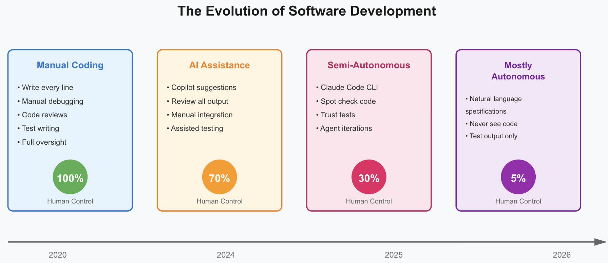
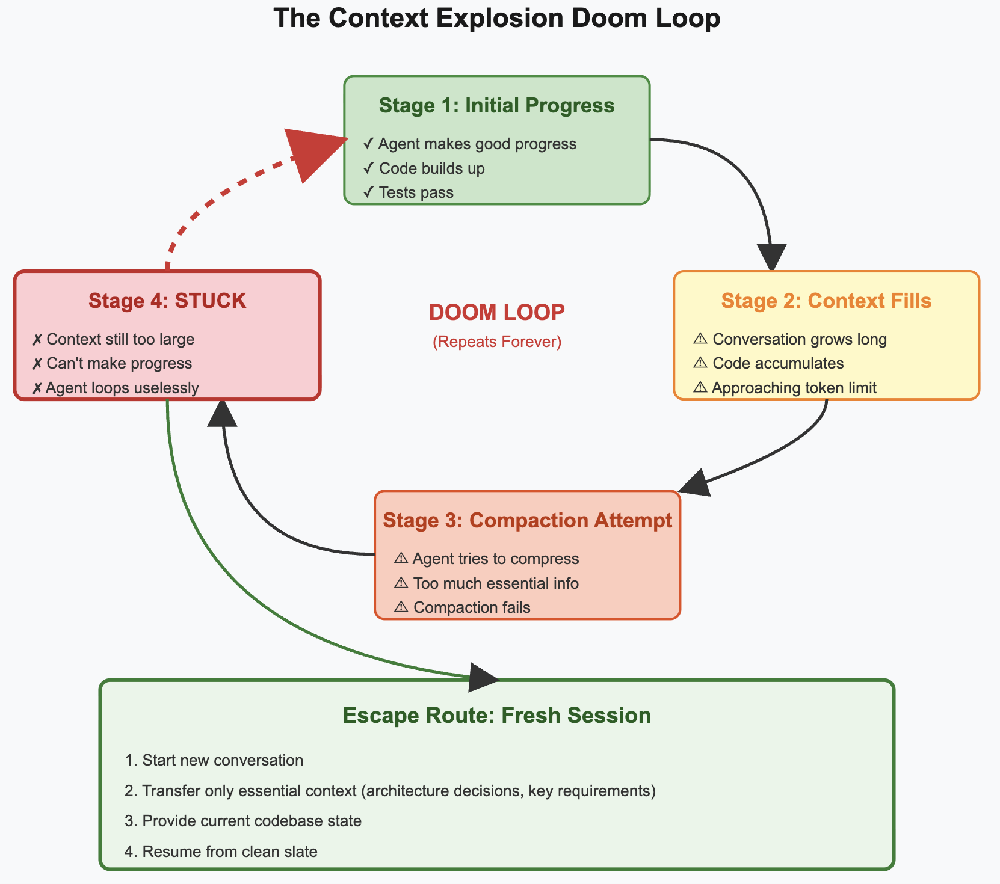
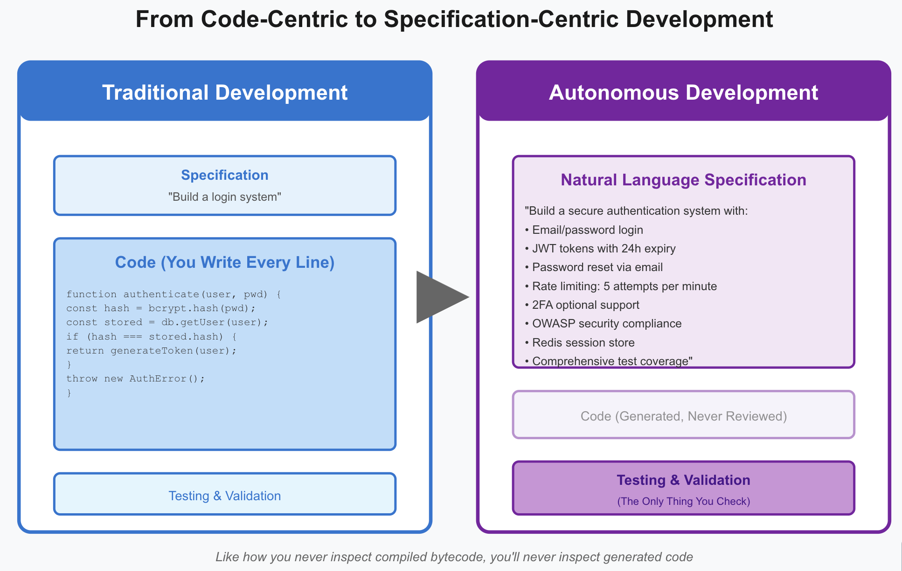

Welcome to my LinkedIn newsletter! In each issue of Breaking the Build, I'll share my thoughts on software development through the looking glass of behavioural sciences. Subscribe to stay updated.

Almost exactly a year ago, I [wrote](https://www.linkedin.com/pulse/developer-has-clothes-asankhaya-sharma-le96c?lipi=urn%3Ali%3Apage%3Ad_flagship3_publishing_post_edit%3BcSe%2B8CshTNaCL0HOBIahSw%3D%3D) about how coding assistants were changing software development. At the time, Claude Sonnet 3.5 was the SOTA coding model, and we were witnessing the early signs of a fundamental shift. Today, that shift has accelerated beyond what I imagined.

We're approaching a point where developers will stop reviewing the code their AI assistants generate. Think about that for a moment. When was the last time you inspected your compiled bytecode? You don't, because you trust the compiler. Natural language is becoming the real specification, and the generated code is just an implementation detail.

## The Frame Experiment
I recently built [Frame](https://github.com/lambdasec/frame), a separation logic prover, entirely using Claude Code on the web. Not "mostly with AI help." Not "AI-assisted development." Completely autonomous. I gave it the specification, Claude Code handled the implementation, tests, and benchmarks. The result? A working CLI tool that does exactly what I needed.

This wasn't a toy project. Frame implements non-trivial verification logic, handles complex state reasoning, and has a comprehensive test suite. The kind of thing that would typically take weeks of careful implementation. Claude Code delivered it in a fraction of that time.

## Research Without Code
Here's where things get interesting. I published two research articles this year on [optimal dataset mixing](https://huggingface.co/blog/codelion/optimal-dataset-mixing) and [optimal model architecture](https://huggingface.co/blog/codelion/optimal-model-architecture). I didn't release the code. Why? Because I never kept track of it.

I worked directly with the coding agent, iterating on experiments, tweaking parameters, running evaluations. The code was ephemeral. The insights were permanent. Someone actually [replicated my dataset mixing research](https://diener.tech/blog/one-billion-token-challenge) without access to my implementation. That tells you everything about where we are. The methodology and results mattered. The specific code? Just plumbing.

This mirrors what Hugging Face recently demonstrated in their [skills training post](https://huggingface.co/blog/hf-skills-training), where they used Claude to train models end-to-end. The pattern is clear: for ML workflows, coding agents are already operating at near-autonomous levels.

## The Reality Check
Claude Code on the web works remarkably well, but it has boundaries. You can't train large models on it. Long-running tests crawl. If you're building a UI-heavy application and need to iterate while seeing the interface, you'll hit friction points. The agent can't experience your app the way you do.

But for certain categories of software, we're already there. CLI tools, backend services, data processing pipelines, anything with good test coverage and clear specifications. These work almost completely autonomously. Frame proved this. My research experiments proved this.

The gaps will close. Next year, the infrastructure limitations will ease. The context windows will expand. The agents will get better at understanding visual feedback. We're not at full autonomy yet, but we're close enough to see it clearly.

## The Doom Loop
There's one failure mode I've encountered repeatedly: the context explosion doom loop. The agent makes progress, the context fills up with code and conversation, it tries to compact, but there's too much essential information. The compaction fails. The agent gets stuck. Progress halts.

The solution? Start a fresh session and transfer just the essential knowledge. It's manual, it's frustrating, but it works. Think of it as a context reset, similar to how you might rewrite a codebase to eliminate accumulated cruft. The pattern will become familiar as we spend more time with these tools.

## 2026 and Beyond
Next year, I predict we'll cross a threshold. Developers will routinely ship code they never inspected. The testing and validation layers will matter more than the implementation. Natural language specifications will be versioned, reviewed, and debated the way we currently debate code.

Some will resist this. The same way some resisted compilers, or garbage collection, or any abstraction that took control away from the programmer. But the productivity gains will be undeniable. The teams that embrace autonomous development will ship faster, iterate quicker, and focus on problems that actually matter.

The software we build won't change much. Good software will still require clear thinking, careful design, and thorough testing. But the process of building it will look completely different. We're not replacing software development. We're automating the mechanical parts and elevating what remains.