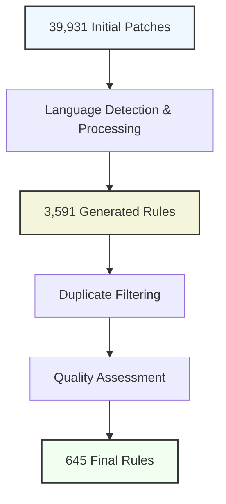

This article presents [Autogrep](https://github.com/lambdasec/autogrep), an automated system for generating and filtering high-quality security rules for static analysis tools. Motivated by recent licensing changes in the Semgrep ecosystem, Autogrep addresses the critical need for maintaining and expanding permissively licensed security rules. By leveraging Large Language Models (LLMs) and a multi-stage filtering pipeline, Autogrep transforms vulnerability patches into precise, generalizable security rules while eliminating duplicates and overly specific patterns.

## 1. Introduction

### 1.1 Background

Static Analysis Security Testing (SAST) tools play a crucial role in modern software security. Semgrep, a popular open-source SAST tool, has gained widespread adoption due to its effectiveness and extensive rule set. However, recent changes in Semgrep's licensing model have created challenges for the security community, leading to the emergence of alternative solutions like OpenGrep.

### 1.2 Motivation

The recent transition of Semgrep's official rules to non-permissive licensing has created a significant gap in the open-source security ecosystem. This change has prompted the creation of OpenGrep, a community fork supported by security vendors, highlighting the need for permissively licensed security rules. Traditional manual rule curation is time-consuming and requires constant maintenance to remain effective.

### 1.3 Contributions

We make the following contributions:

1. Introduces an automated pipeline for generating Semgrep rules from vulnerability patches
2. Presents a novel filtering system that ensures rule quality and generalizability
3. Demonstrates the effectiveness of using LLMs for security rule generation
4. Provides a significant set of permissively licensed security rules across multiple languages

## 2. System Architecture

### 2.1 Overview

Autogrep consists of two main components:

1. **Rule Generation Pipeline**: Analyzes vulnerability patches and generates corresponding Semgrep rules using LLM-based pattern extraction
2. **Rule Filtering System**: Validates and filters generated rules through multiple quality checks

### 2.2 Rule Generation

The rule generation process involves:

1. Patch Analysis
   - Extraction of changed code segments
   - Language detection
   - Context analysis

2. LLM-Based Rule Creation
   - Pattern identification
   - Rule structure generation
   - Metadata enhancement

### 2.3 Rule Filtering

The filtering pipeline implements multiple stages:

1. **Duplicate Detection**
   - Uses sentence embeddings for semantic similarity
   - Identifies and removes redundant rules

2. **Quality Evaluation**
   - LLM-based assessment of rule generalizability
   - Elimination of project-specific patterns

3. **Validation**
   - Testing against original vulnerabilities
   - Verification of fix detection

## 3. Dataset and Methodology

### 3.1 Dataset

We utilized the oreFixes dataset, a comprehensive collection of CVE fix commits:

- Total Patches: 39,931
- Unique CVEs: 26,617
- Source Repositories: 6,945

### 3.2 Processing Pipeline

## 4. Results and Analysis

### 4.1 Generation Statistics

Initial Dataset:
- 39,931 patches processed
- 26,617 unique CVEs
- 6,945 source repositories

Generation Results:
- 3,591 rules generated
- Coverage across 20 programming languages

### 4.2 Filtering Results

Rule Reduction Analysis:
- Initial Rules: 3,591 (100%)
- Duplicates Removed: 386 (10.75%)
- Trivial Rules Removed: 5 (0.14%)
- Overly Specific Rules Removed: 2,555 (71.15%)
- Final Rules: 645 (17.96%)

### 4.3 Language Distribution

The final rule set spans 20 programming languages, providing broad coverage across different technology stacks. Key languages include:
- Python
- JavaScript
- Java
- Go
- Ruby

## 5. Discussion

### 5.1 Rule Quality Analysis

The high percentage of rules removed due to over-specificity (71.15%) demonstrates the importance of our filtering pipeline in ensuring rule generalizability. The relatively low number of trivial rules (0.14%) suggests that the LLM-based generation process produces substantive patterns.

### 5.2 Effectiveness of Automation

The successful transformation of 39,931 patches into 645 high-quality rules demonstrates the effectiveness of automated rule generation. The reduction ratio indicates strong quality control while maintaining significant coverage.

### 5.3 Comparison with Manual Curation

Compared to traditional manual rule creation:
- Significantly faster generation time
- Consistent quality through automated validation
- Broader language coverage
- Reduced maintenance overhead

## 6. Conclusion and Future Work

Autogrep demonstrates the feasibility of automated security rule generation and filtering at scale. The system successfully processes a large dataset of vulnerability patches to produce a focused set of high-quality, permissively licensed security rules.

### Future Work

1. Enhancement of rule generation accuracy through improved LLM prompting
2. Expansion of supported languages and vulnerability types
3. Integration of community feedback mechanisms
4. Development of automated rule update procedures

## References

1. [Semgrep Project](https://github.com/semgrep/semgrep)
2. [OpenGrep Project](https://github.com/opengrep/opengrep)
3. [Patched Codes Semgrep Rules](https://github.com/patched-codes/semgrep-rules)
4. [MoreFixes Dataset](https://zenodo.org/records/13983082)
