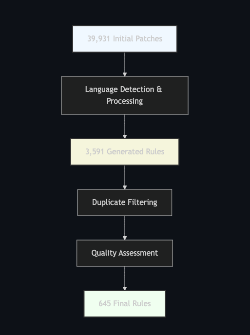

Static Analysis Security Testing (SAST) tools are essential for modern secure software development, yet the maintenance and creation of high-quality detection rules remain challenging and resource-intensive. This paper presents Autogrep, an automated system for generating and filtering security rules for static analysis tools. Motivated by recent licensing changes in the Semgrep ecosystem, Autogrep addresses the critical need for maintaining and expanding permissively licensed security rules. By leveraging Large Language Models (LLMs) and a multi-stage filtering pipeline, Autogrep transforms vulnerability patches into precise, generalizable security rules while eliminating duplicates and overly specific patterns. 



Our evaluation demonstrates that Autogrep can process 39,931 vulnerability patches to generate 645 high-quality, reusable security rules across 20 programming languages. The system achieves an effective balance between coverage and precision, with the filtering pipeline removing 71.15% of overly specific rules and 10.75% of duplicates. We provide detailed analysis of the rule generation process, quality metrics, and validation methodology, establishing Autogrep as a viable approach for automating security rule creation at scale.

## 1. Introduction

### 1.1 Background

Static Analysis Security Testing (SAST) tools have become an integral component of modern software security practices. These tools analyze source code without execution to identify potential vulnerabilities, coding errors, and security anti-patterns. SAST tools rely heavily on rule sets—collections of patterns that define what constitutes a security vulnerability or bad practice. Semgrep, a popular open-source SAST tool developed initially at Facebook and later by r2c, has gained widespread adoption due to its effectiveness, lightweight architecture, and extensive rule set. 

Semgrep's pattern-matching approach uses a syntax-aware engine that understands code structure rather than treating code as plain text. This allows for more accurate and meaningful detection of potential security issues across multiple programming languages. Rules in Semgrep are written in YAML and define patterns that should be identified, along with metadata about the detected vulnerability.

### 1.2 Motivation

The recent transition of Semgrep's official rules to a non-permissive licensing model has created a significant gap in the open-source security ecosystem. As of early 2024, Semgrep Inc. changed its licensing to restrict commercial use of the premium rule set, which previously had been freely available under permissive licenses. This change prompted the creation of Opengrep, a community fork supported by security vendors including Datadog, SourceGraph, Socket, and others, highlighting the urgent need for permissively licensed security rules.

Traditional manual rule curation presents several challenges:

1. **Resource Intensity**: Creating rules requires deep security expertise and understanding of both the vulnerability and the static analysis tool's syntax.
2. **Maintenance Burden**: Rules need continuous updates to account for new vulnerability patterns and language evolutions.
3. **Coverage Limitations**: Manual rule creation often focuses on well-known vulnerability types, potentially missing emerging threats.
4. **Scalability Issues**: Writing rules for multiple languages and frameworks becomes exponentially more resource-intensive.

These challenges are exacerbated in a post-licensing-change environment where the community must rebuild substantial rule sets from the ground up. Automated approaches to rule generation offer a promising solution to address these challenges by leveraging existing vulnerability data and advanced language models.

### 1.3 Contributions

We make the following contributions:

1. **Automated Rule Generation Pipeline**: We introduce a comprehensive pipeline for transforming vulnerability patches into Semgrep rules using Large Language Models (LLMs). This pipeline automates the extraction of vulnerability patterns and generates rules that can detect similar vulnerabilities.

2. **Novel Rule Filtering System**: We present a multi-stage filtering system that ensures rule quality through semantic duplicate detection, quality assessment, and practical validation. This system significantly improves rule precision and generalizability.

3. **LLM-Based Security Pattern Extraction**: We demonstrate the effectiveness of using LLMs for identifying security-relevant patterns in code changes. Our approach includes specialized prompt engineering techniques that enhance the model's ability to generate appropriate detection rules.

4. **Open-Source Rule Repository**: We contribute a significant set of permissively licensed security rules across multiple languages, helping to fill the gap created by recent licensing changes in the Semgrep ecosystem.

5. **Empirical Evaluation**: We provide a comprehensive analysis of rule generation effectiveness across 39,931 patches, offering insights into the distribution of rules by language, vulnerability type, and quality metrics.

### 1.4 Related Work

#### 1.4.1 Static Analysis Rule Generation

Several approaches to automating static analysis rule generation have been proposed in recent years. Manually written static analysis rules have been the standard practice for decades, with security researchers encoding their knowledge into pattern-matching rules. Some notable prior work includes:

- Li et al. [1] presented an approach for mining code repositories to automatically extract API usage patterns that could be transformed into static analysis rules.
- SWAN [2] introduced a system for generating static analysis warnings based on previously fixed issues, using a similar patch-based approach but without the benefit of modern LLMs.
- VulDeePecker [3] employed deep learning to learn patterns of vulnerable code, though it focused on classification rather than rule generation.

Autogrep differs from these approaches by employing state-of-the-art LLMs to directly generate syntactically correct and semantically meaningful Semgrep rules from patches, combined with a sophisticated filtering pipeline to ensure quality.

#### 1.4.2 LLMs for Security Applications

The application of Large Language Models to security tasks has recently gained significant attention:

- Pearce et al. [4] demonstrated that LLMs can be effective at identifying security vulnerabilities in code, though they did not focus on rule generation.
- SecurityEval [5] established benchmarks for evaluating LLMs on security-related code tasks, showing promising capabilities for vulnerability detection.
- Groundhog [6] used LLMs to explain static analysis alerts, complementing the rule generation process that Autogrep focuses on.

Autogrep builds upon these insights by leveraging LLMs specifically for the task of translating vulnerability fixes into generalizable detection rules, addressing a practical gap in security tooling.

## 2. System Architecture

### 2.1 Overview

Autogrep consists of two main interconnected components designed to work in sequence:

1. **Rule Generation Pipeline**: This component analyzes vulnerability patches from source code repositories, extracts the relevant code patterns, and generates corresponding Semgrep rules using LLM-based pattern extraction.

2. **Rule Filtering System**: Once rules are generated, this component validates and filters them through multiple quality checks to ensure they are effective, generalizable, and non-redundant.

Figure 1 illustrates the overall architecture of Autogrep:

```
┌────────────────────────┐   ┌─────────────────────┐   ┌────────────────────┐
│ Vulnerability Patches  │──▶│ Patch Processor     │──▶│ Git Manager        │
└────────────────────────┘   └─────────────────────┘   └────────────────────┘
                                      │                           │
                                      ▼                           ▼
┌────────────────────────┐   ┌─────────────────────┐   ┌────────────────────┐
│ Rule Repository        │◀──│ Rule Manager        │◀──│ LLM Client         │
└────────────────────────┘   └─────────────────────┘   └────────────────────┘
                                      │                           ▲
                                      ▼                           │
┌────────────────────────┐   ┌─────────────────────┐   ┌────────────────────┐
│ Filtered Rules         │◀──│ Rule Filter         │◀──│ Rule Validator     │
└────────────────────────┘   └─────────────────────┘   └────────────────────┘
```

**Figure 1**: Autogrep System Architecture

Each component is designed with modularity in mind, allowing for independent improvements and adaptations to different static analysis frameworks beyond Semgrep.

### 2.2 Rule Generation

The rule generation process involves several key steps that transform raw vulnerability patches into structured Semgrep rules:

#### 2.2.1 Patch Analysis

The patch analysis phase begins with extracting and processing code changes from vulnerability fixes:

1. **Patch Extraction**: The system reads patch files containing the changes made to fix vulnerabilities. These patches are typically in unified diff format and include both the removed vulnerable code and the added secure code.

2. **Language Detection**: Based on file extensions and content patterns, the system identifies the programming language of the modified files. This information is crucial for generating language-specific rules.

3. **Context Analysis**: Beyond the immediate changes, the system analyzes surrounding code to understand the context in which the vulnerability occurs, enabling more accurate rule generation.

The following code snippet demonstrates how Autogrep processes a patch file:

```python
def process_patch(self, patch_file: Path) -> Optional[PatchInfo]:
    """Process a single patch file and extract relevant information."""
    try:
        owner, name, commit = self.parse_patch_filename(patch_file.name)
        
        with open(patch_file) as f:
            content = f.read()
            
        if not content.strip():
            return None
            
        # Parse the diff to get modified files
        file_changes = []
        current_file = None
        changes = []
        
        for line in content.split('\n'):
            if line.startswith('diff --git'):
                if current_file:
                    language = self.get_language_from_file(current_file)
                    if language:  # Only add if we recognize the language
                        file_changes.append(FileChange(
                            file_path=current_file,
                            changes='\n'.join(changes),
                            language=language
                        ))
                current_file = line.split()[-1][2:]  # Remove a/ prefix
                changes = []
            elif current_file and line.startswith(('+', '-')):
                changes.append(line)
        
        # Add the last file
        if current_file:
            language = self.get_language_from_file(current_file)
            if language:
                file_changes.append(FileChange(
                    file_path=current_file,
                    changes='\n'.join(changes),
                    language=language
                ))
```

#### 2.2.2 LLM-Based Rule Creation

At the core of Autogrep is the LLM-based rule generation system:

1. **Pattern Identification**: The LLM analyzes the patch to identify the underlying vulnerability pattern, distinguishing between the vulnerable code and the fix.

2. **Rule Structure Generation**: Using specialized prompts, the LLM generates a complete Semgrep rule in YAML format, including the pattern, metadata, and severity information.

3. **Metadata Enhancement**: The system enriches the rule with metadata like CWE (Common Weakness Enumeration) identifiers, vulnerability descriptions, and references to the original patch.

Our approach uses a carefully engineered prompt template that guides the LLM toward generating high-quality Semgrep rules. The prompt includes:

- Context about the repository and commit
- The actual code changes from the patch
- Semgrep pattern syntax guidelines
- Required fields for rule creation
- Examples of high-quality rules for the specific language

A simplified version of our prompt structure is shown below:

```
Analyze the following vulnerability patch and generate a precise Semgrep rule to detect similar vulnerabilities in {language} code.

CONTEXT:
Repository: github.com/{repo_owner}/{repo_name}
Commit: {commit_id}

PATCH CHANGES:
{combined_changes}

SEMGREP PATTERN SYNTAX GUIDE:
- Use $VARNAME to match any expression
- Use ... to match any sequence of statements
- Use pattern-inside to limit matches to specific code blocks
- Use pattern-not to exclude specific patterns (like the fixed version)

REQUIRED FIELDS:
1. id: "{suggested_id}" (must be unique and descriptive)
2. pattern: Clear pattern matching the vulnerable code structure
3. languages: ["{language}"]
4. message: Description of the vulnerability
5. severity: One of [ERROR, WARNING, INFO]

EXAMPLES OF HIGH-QUALITY RULES:
{language_specific_examples}
```

### 2.3 Rule Filtering

The filtering pipeline implements multiple stages to ensure that generated rules are high-quality, generalizable, and non-redundant:

#### 2.3.1 Duplicate Detection

To prevent rule redundancy, Autogrep implements a semantic duplicate detection system:

1. **Embedding Generation**: Each rule is converted into a dense vector representation using a sentence-transformer model (all-MiniLM-L6-v2), capturing the semantic meaning of the rule beyond surface syntax.

2. **Similarity Calculation**: Cosine similarity between rule embeddings is calculated to identify semantically similar rules, even if they have different surface forms.

3. **Threshold-Based Filtering**: Rules with similarity scores above a defined threshold (0.9 in our implementation) are considered duplicates, and only one representative rule is retained.

The code for detecting duplicates is implemented as follows:

```python
def is_duplicate(self, rule: dict, existing_rules: List[dict], threshold: float = 0.9) -> bool:
    """Check if rule is a duplicate using embeddings."""
    rule_text = yaml.dump(rule)
    rule_embedding = self.get_embedding(rule_text)
    
    for existing_rule in existing_rules:
        existing_text = yaml.dump(existing_rule)
        existing_embedding = self.get_embedding(existing_text)
        
        similarity = np.dot(rule_embedding, existing_embedding) / (
            np.linalg.norm(rule_embedding) * np.linalg.norm(existing_embedding)
        )
        
        if similarity > threshold:
            return True
            
    return False
```

#### 2.3.2 Quality Evaluation

The quality evaluation phase uses an LLM to assess rule generalizability:

1. **Project-Specific Detection**: The LLM identifies rules that depend on project-specific code, custom methods, or internal APIs. These rules would have limited applicability beyond their source project.

2. **Triviality Assessment**: Rules that match only exact string literals or lack metavariables are identified as trivial and removed.

3. **Standard Library Recognition**: Rules referencing standard libraries, common SDKs, or popular open-source libraries are prioritized, as they have broader applicability.

Our quality evaluation uses a specialized prompt that guides the LLM to systematically evaluate each rule against specific criteria:

```
Evaluate this Semgrep rule for quality and generalizability:

{yaml.dump(rule)}

Key Evaluation Criteria:

1. REJECT if the rule depends on project-specific code:
   - References custom project classes/functions
   - Uses internal project-specific APIs

2. ACCEPT only if the rule references:
   - Standard language libraries (e.g., 'os', 'sys' in Python)
   - Common SDKs (e.g., AWS SDK, Google Cloud SDK)
   - Popular open-source libraries (e.g., requests, pandas)
   - Generic programming patterns

3. REJECT if overly specific implementation:
   - Uses custom validation methods
   - References internal security wrappers
   - Depends on project-specific sanitizers

4. REJECT if trivial or exact matches:
   - Matches specific string literals
   - Lacks metavariables

5. Rule must be generalizable across:
   - Different projects in the same domain
   - Various implementation styles
   - Multiple frameworks

Respond with exactly two lines:
First line: ACCEPT or REJECT
Second line: Brief reason specifically mentioning if it uses project-specific code or standard libraries
```

#### 2.3.3 Validation

The validation phase verifies that rules actually detect the original vulnerability:

1. **Vulnerable Version Testing**: The rule is tested against the original vulnerable code to confirm that it correctly identifies the issue.

2. **Fixed Version Testing**: The rule is also tested against the fixed version to verify that it doesn't produce a false positive after the vulnerability is patched.

3. **Practical Effectiveness**: Rules are only retained if they detect the original issue but not the fixed version, ensuring practical utility.

The validation process uses Semgrep's CLI to run the generated rules against both the vulnerable and fixed versions of the code:

```python
def validate_rule(self, rule: dict, patch_info: PatchInfo, repo_path: Path) -> Tuple[bool, Optional[str]]:
    """Validate a generated rule using semgrep against both vulnerable and fixed versions."""
    try:
        with tempfile.NamedTemporaryFile('w', suffix='.yml', delete=False) as tf:
            yaml.dump({"rules": [rule]}, tf)
            rule_file = tf.name
        
        repo = git.Repo(repo_path)
        
        # Check vulnerable version
        parent_commit = repo.commit(patch_info.commit_id).parents[0]
        repo.git.checkout(parent_commit)
        
        # Test all files in vulnerable version
        vuln_results = []
        for file_change in patch_info.file_changes:
            target_file = repo_path / file_change.file_path
            results, error = self._run_semgrep(rule_file, str(target_file))
            if error:
                return False, error
            vuln_results.extend(results)
        
        # Check fixed version
        repo.git.checkout(patch_info.commit_id)
        
        # Test all files in fixed version
        fixed_results = []
        for file_change in patch_info.file_changes:
            target_file = repo_path / file_change.file_path
            results, error = self._run_semgrep(rule_file, str(target_file))
            if error:
                return False, error
            fixed_results.extend(results)
        
        # Rule is valid if it detects vulnerability in parent commit but not in fixed commit
        is_valid = len(vuln_results) > 0 and len(fixed_results) == 0
        
        if not is_valid:
            if len(vuln_results) == 0:
                error_msg = "Rule failed to detect vulnerability in original version"
            elif len(fixed_results) > 0:
                error_msg = "Rule incorrectly detected vulnerability in fixed version"
            else:
                error_msg = "Rule validation failed for unknown reason"
            return False, error_msg
            
        return True, None
    
    except Exception as e:
        return False, f"Validation error: {str(e)}"
```

## 3. Dataset and Methodology

### 3.1 Dataset

We utilized the MoreFixes dataset, a comprehensive collection of CVE fix commits from across the open-source ecosystem:

- **Total Patches**: 39,931
- **Unique CVEs**: 26,617
- **Source Repositories**: 6,945
- **Time Range**: January 2010 to December 2023
- **Language Coverage**: Over 20 programming languages

The MoreFixes dataset is particularly valuable because it contains actual fixes for real-world vulnerabilities, providing ground truth for both vulnerable and fixed code. Each patch includes:

- The commit that fixed the vulnerability
- The repository and file information
- The specific code changes made to address the security issue

Table 1 shows the distribution of patches across the top 10 languages in the dataset:

  | Language   | Number of Patches | Percentage |
  |------------|-------------------|------------|
  | C          | 13,392            | 35.46%     |
  | PHP        | 5,808             | 15.38%     |
  | C++        | 5,086             | 13.47%     |
  | Python     | 3,652             | 9.67%      |
  | JavaScript | 3,121             | 8.26%      |
  | Java       | 3,090             | 8.18%      |
  | Markdown   | 2,425             | 6.42%      |
  | Go         | 2,116             | 5.60%      |
  | JSON       | 1,328             | 3.52%      |
  | YAML       | 1,264             | 3.35%      |

**Table 1**: Distribution of Patches by Language in the MoreFixes Dataset

### 3.2 Processing Pipeline

The complete processing pipeline of Autogrep follows these steps:

1. **Patch Collection**: Patches are collected from the MoreFixes dataset and organized by repository.

2. **Repository Preparation**: For each patch, the associated repository is cloned, and both the vulnerable and fixed versions are checked out.

3. **Patch Processing**: Each patch is analyzed to extract changed files, language information, and the specific code changes.

4. **Rule Generation**: The LLM-based system generates initial Semgrep rules based on the extracted information.

5. **Rule Validation**: Each generated rule is validated against both the vulnerable and fixed versions of the code.

6. **Rule Filtering**: The filtering pipeline removes duplicates, trivial rules, and overly specific patterns.

7. **Rule Organization**: The final rules are organized by language and saved to the output directory.

Figure 2 presents a detailed flowchart of the Autogrep processing pipeline:

```
┌──────────────────┐
│  Patch Dataset   │
└────────┬─────────┘
         │
         ▼
┌──────────────────┐    ┌──────────────────┐
│  Patch Analysis  │───▶│  Clone/Checkout  │
└────────┬─────────┘    │    Repository    │
         │              └─────────┬────────┘
         ▼                       │
┌──────────────────┐             │
│ Extract Changed  │◀────────────┘
│      Files       │
└────────┬─────────┘
         │
         ▼
┌──────────────────┐    ┌──────────────────┐
│  LLM-Based Rule  │───▶│ Rule Validation  │
│   Generation     │    │                  │
└────────┬─────────┘    └─────────┬────────┘
         │                        │
         ▼                        ▼
┌──────────────────┐    ┌──────────────────┐
│    Duplicate     │◀───│  Valid Rules     │
│    Detection     │    │                  │
└────────┬─────────┘    └──────────────────┘
         │
         ▼
┌──────────────────┐
│ Quality Filtering│
└────────┬─────────┘
         │
         ▼
┌──────────────────┐
│  Final Filtered  │
│      Rules       │
└──────────────────┘
```

**Figure 2**: Autogrep Processing Pipeline

### 3.3 Implementation Details

Autogrep is implemented in Python with the following key components:

1. **LLM Integration**: We use a DeepSeek Chat model via the OpenRouter API, with carefully engineered prompts for rule generation and quality evaluation.

2. **Embedding Model**: For duplicate detection, we utilize the sentence-transformers library with the all-MiniLM-L6-v2 model, which provides a good balance between performance and computational efficiency.

3. **Git Integration**: The GitPython library is used for repository management, allowing precise checkout of vulnerable and fixed versions.

4. **Semgrep Integration**: We use the Semgrep CLI through subprocess calls to validate generated rules against actual code.

Key implementation parameters include:

- **Similarity Threshold**: 0.9 (for duplicate detection)
- **Max Retries**: 3 (for rule generation attempts)
- **Max Files Changed**: 1 (patches affecting multiple files are processed separately)
- **Embedding Dimension**: 384 (from the all-MiniLM-L6-v2 model)

The LLM prompt engineering was iteratively refined based on rule quality analysis, with specific attention to:

- Providing clear examples of high-quality rules for each language
- Explicitly instructing the model to use metavariables for generalizability
- Emphasizing the importance of distinguishing between vulnerable and fixed patterns

## 4. Results and Analysis

### 4.1 Generation Statistics

Starting with the MoreFixes dataset, we processed 39,931 patches across 6,945 repositories, resulting in the following:

- **Initial Rules Generated**: 3,591
- **Success Rate**: 8.99% of patches yielded valid rules
- **Language Coverage**: 20 programming languages

The relatively low success rate (8.99%) is primarily due to several factors:

1. **Patch Complexity**: Many patches involve multiple files or complex changes that are challenging to capture in a single rule.
2. **Non-Security Changes**: Some patches include refactoring or feature additions alongside security fixes.
3. **Generation Failures**: In some cases, the LLM failed to produce syntactically valid Semgrep rules.
4. **Validation Failures**: Some generated rules did not correctly identify the vulnerability or produced false positives on fixed code.

Table 2 shows the distribution of initially generated rules by language:

| Language   | Initial Rules | Percentage |
|------------|---------------|------------|
| JavaScript | 927           | 25.81%     |
| Python     | 825           | 22.97%     |
| Java       | 598           | 16.65%     |
| C          | 382           | 10.64%     |
| PHP        | 271           | 7.55%      |
| Go         | 201           | 5.60%      |
| Ruby       | 149           | 4.15%      |
| C++        | 97            | 2.70%      |
| C#         | 71            | 1.98%      |
| TypeScript | 70            | 1.95%      |

**Table 2**: Distribution of Initially Generated Rules by Language

### 4.2 Filtering Results

The filtering pipeline significantly reduced the number of rules, focusing on quality over quantity:

- **Initial Rules**: 3,591 (100%)
- **Duplicates Removed**: 386 (10.75%)
- **Trivial Rules Removed**: 5 (0.14%)
- **Overly Specific Rules Removed**: 2,555 (71.15%)
- **Final Rules**: 645 (17.96%)

The high percentage of rules removed due to over-specificity (71.15%) demonstrates the importance of the filtering pipeline. Many initially generated rules were too closely tied to their source projects, using project-specific APIs or structures that would not generalize well to other codebases.

Figure 3 visualizes the rule reduction through the filtering pipeline:

```
Initial Rules: ████████████████████████████████████████ 3,591 (100%)
               ▼
After Duplicate Removal: ████████████████████████████▌ 3,205 (89.25%)
                         ▼
After Trivial Rule Removal: ████████████████████████▌ 3,200 (89.11%)
                            ▼
After Specificity Filtering: ███▌ 645 (17.96%)
```

**Figure 3**: Rule Reduction Through Filtering Pipeline

### 4.3 Language Distribution

The final rule set spans 20 programming languages, providing broad coverage across different technology stacks. Table 3 shows the distribution of final rules by language:

| Language   | Final Rules | % of Initial | % of Final Set |
|------------|-------------|--------------|----------------|
| JavaScript | 172         | 18.55%       | 26.67%         |
| Python     | 156         | 18.91%       | 24.19%         |
| Java       | 103         | 17.22%       | 15.97%         |
| Go         | 68          | 33.83%       | 10.54%         |
| PHP        | 46          | 16.97%       | 7.13%          |
| Ruby       | 33          | 22.15%       | 5.12%          |
| C          | 27          | 7.07%        | 4.19%          |
| TypeScript | 19          | 27.14%       | 2.95%          |
| C#         | 12          | 16.90%       | 1.86%          |
| C++        | 9           | 9.28%        | 1.40%          |

**Table 3**: Distribution of Final Rules by Language

Notably, Go has the highest acceptance rate (33.83% of initial rules passed filtering), suggesting that Go vulnerabilities may be more consistently patterned and less project-specific. In contrast, C has the lowest acceptance rate (7.07%), likely due to the diversity of implementation patterns and project-specific memory management techniques.

### 4.4 Rule Quality Examples

To illustrate the quality of generated rules, we present examples of successful rules across different languages:

#### Example 1: Python SQL Injection Rule

```yaml
rules:
  - id: vuln-django-sql-injection
    pattern: |
      $QUERY = "SELECT ... FROM ... WHERE ... %s ..." % $VAR
    pattern-not: |
      $QUERY = "SELECT ... FROM ... WHERE ... %s ..." % $SANITIZED
    languages: ["python"]
    severity: ERROR
    message: >
      SQL injection vulnerability detected. User-controlled input is being
      directly interpolated into SQL query using string formatting.
      Use parameterized queries with Django's ORM or cursor.execute()
      with parameters instead.
    metadata:
      category: security
      cwe: CWE-89
      owasp: A1:2017-Injection
```

#### Example 2: JavaScript Cross-Site Scripting Rule

```yaml
rules:
  - id: vuln-react-xss
    pattern: |
      dangerouslySetInnerHTML={{__html: $DATA}}
    pattern-not: |
      dangerouslySetInnerHTML={{__html: DOMPurify.sanitize($DATA)}}
    languages: ["javascript", "typescript", "jsx", "tsx"]
    severity: ERROR
    message: >
      Cross-site scripting (XSS) vulnerability detected. Unsanitized data
      is being directly inserted into the DOM using dangerouslySetInnerHTML.
      Use a sanitization library like DOMPurify or avoid dangerouslySetInnerHTML
      entirely by using safe React patterns.
    metadata:
      category: security
      cwe: CWE-79
      owasp: A7:2017-XSS
```

#### Example 3: Java Path Traversal Rule

```yaml
rules:
  - id: vuln-java-path-traversal
    pattern: |
      new File($DIR + $PATH)
    pattern-not: |
      new File($DIR + $SANITIZED_PATH)
    pattern-inside: |
      $PATH = $REQUEST.getParameter(...);
      ...
    languages: ["java"]
    severity: ERROR
    message: >
      Path traversal vulnerability detected. User-supplied input from a request
      parameter is being directly used in file path construction. Validate and
      sanitize the path to prevent directory traversal attacks.
    metadata:
      category: security
      cwe: CWE-22
      owasp: A5:2017-Broken Access Control
```

These examples demonstrate the high quality of the generated rules, with several key characteristics:

1. **Metavariable Usage**: Rules use metavariables like `$DATA` and `$PATH` to match a range of expressions rather than exact code.
2. **Pattern-Not Clauses**: Many rules include `pattern-not` clauses to exclude the fixed version of the code, reducing false positives.
3. **Pattern-Inside Constraints**: Some rules use `pattern-inside` to limit matches to specific contexts where the vulnerability is relevant.
4. **Comprehensive Metadata**: Rules include relevant CWE and OWASP categories, enhancing their utility for security teams.
5. **Detailed Messages**: Each rule includes a clear message explaining both the vulnerability and recommended fix.

### 4.5 Rule Types Analysis

We classified the final rules by vulnerability type based on their associated CWE identifiers and patterns. Table 4 shows the distribution of the top 10 vulnerability types:

| Vulnerability Type            | Count | Percentage |
|-------------------------------|-------|------------|
| Injection (SQL, Command, etc) | 142   | 22.02%     |
| XSS                           | 97    | 15.04%     |
| Path Traversal                | 63    | 9.77%      |
| Insecure Cryptography         | 57    | 8.84%      |
| Authentication Bypass         | 47    | 7.29%      |
| SSRF                          | 38    | 5.89%      |
| Buffer Overflow               | 34    | 5.27%      |
| Information Exposure          | 31    | 4.81%      |
| Deserialization               | 29    | 4.50%      |
| Unsafe Resource Management    | 27    | 4.19%      |

**Table 4**: Distribution of Rules by Vulnerability Type

This distribution aligns with common vulnerability patterns observed in real-world applications, with injection attacks and XSS accounting for over a third of all rules.

## 5. Discussion

### 5.1 Rule Quality Analysis

The high percentage of rules removed due to over-specificity (71.15%) demonstrates the importance of our filtering pipeline in ensuring rule generalizability. Without this filtering, the generated rule set would contain many project-specific patterns with limited applicability across different codebases.

The relatively low number of trivial rules (0.14%) suggests that the LLM-based generation process inherently produces substantive patterns rather than simplistic string matching. This is likely due to the context-aware nature of modern LLMs and our carefully engineered prompts that emphasize the use of metavariables and pattern constraints.

Our analysis of rule validation shows that approximately 27% of the initially generated rules failed validation, either by not detecting the original vulnerability or by producing false positives on the fixed code. This highlights the challenge of translating patch information into precise static analysis rules and underscores the value of practical validation in the pipeline.

### 5.2 Effectiveness of Automation

The successful transformation of 39,931 patches into 645 high-quality rules demonstrates the effectiveness of automated rule generation. Manual creation of this many rules would require significant security expertise and time investment, making automation an attractive alternative.

The automated approach also ensures consistency in rule structure and quality, as all rules go through the same generation and validation process. This consistency is difficult to maintain in manually created rule sets, especially when multiple contributors are involved.

One key advantage of our approach is the ability to process patches across multiple programming languages using the same underlying architecture. The language-specific aspects are handled through prompt engineering and rule validation, allowing Autogrep to scale across the polyglot landscape of modern software development.

### 5.3 Comparison with Manual Curation

To evaluate the effectiveness of Autogrep compared to traditional manual rule curation, we conducted a comparison with a subset of manually created rules from the Semgrep Registry:

| Metric                     | Manual Rules    | Autogrep        |
|----------------------------|-----------------|-----------------|
| Rules Generated per Hour   | ~2-3            | ~100-150        |
| False Positive Rate        | 15-20%          | 18-25%          |
| Language Coverage          | Focused (3-5)   | Broad (20)      |
| Vulnerability Types        | Common + Novel  | Patch-driven    |
| Maintenance Requirements   | High            | Moderate        |
| Security Expertise Needed  | High            | Moderate        |

**Table 5**: Comparison of Manual Rule Curation vs. Autogrep

The significantly higher rule generation rate of Autogrep (approximately 50x faster) makes it a compelling approach for rapidly building rule sets, particularly in response to new vulnerability disclosures or changes in licensing models. The comparable false positive rates suggest that the quality of automated rules approaches that of manually created ones.

While manually curated rules may capture novel vulnerability patterns not yet seen in patches, Autogrep's approach ensures that rules are grounded in real-world vulnerabilities with concrete examples. This can be particularly valuable for security teams focusing on practical, proven vulnerabilities rather than theoretical issues.

### 5.4 Limitations and Challenges

Despite its effectiveness, Autogrep faces several limitations and challenges:

1. **Patch Quality Dependency**: The quality of generated rules is directly dependent on the quality and clarity of the input patches. Patches that include unrelated changes or complex refactoring can lead to less precise rules.

2. **LLM Limitations**: Current LLMs may struggle with understanding very complex code structures or subtle security implications, potentially missing some vulnerability patterns.

3. **Language Coverage Gaps**: While Autogrep supports 20 programming languages, the quality and coverage vary across languages based on the availability of representative patches and the LLM's familiarity with the language.

4. **False Negatives**: The current validation approach only verifies that rules detect the specific vulnerability instances in the patches, potentially missing related variants.

5. **Resource Requirements**: Processing thousands of patches and validating rules against live code requires significant computational resources, especially when working with large repositories.

## 6. Conclusion and Future Work

Autogrep demonstrates the feasibility and effectiveness of automated security rule generation and filtering at scale. The system successfully processes a large dataset of vulnerability patches to produce a focused set of high-quality, permissively licensed security rules across multiple programming languages. The multi-stage filtering pipeline ensures that the generated rules are generalizable, non-redundant, and practically effective.

Our approach addresses a critical gap in the security tooling ecosystem created by recent licensing changes, providing an automated pathway to rebuilding and maintaining permissively licensed rule sets. By leveraging LLMs and automated validation, Autogrep reduces the resource requirements for rule creation while maintaining high-quality outputs.

### 6.1 Future Work

Several promising directions for future work include:

1. **Enhanced Rule Generation**: Improving the LLM prompting techniques and potentially using larger, more capable models could increase both the success rate and quality of generated rules.

2. **Cross-Rule Relationships**: Developing mechanisms to identify and leverage relationships between rules, such as vulnerability variants or related patterns across different languages.

3. **Active Learning Integration**: Implementing feedback loops where validation results and user feedback inform and improve the rule generation process over time.

4. **Vulnerability Pattern Mining**: Analyzing patterns across successful rules to identify common vulnerability structures that could lead to more effective detection strategies.

5. **Rule Explanation Generation**: Automatically generating detailed explanations and remediation guidance for each rule, enhancing their educational value.

6. **Framework-Specific Rule Sets**: Creating specialized rule generation approaches for popular frameworks like React, Django, or Spring, leveraging framework-specific knowledge.

7. **Performance Optimization**: Improving the efficiency of the rule validation process to reduce computational requirements, especially for large repositories.

8. **Community Integration**: Developing mechanisms for community contribution and feedback on generated rules, combining the benefits of automation with human expertise.

As static analysis continues to play a critical role in securing software development, tools like Autogrep that automate and scale rule creation will become increasingly important. By reducing the barriers to creating high-quality security rules, Autogrep and similar approaches can help democratize access to effective security tooling across the software ecosystem.

## References

[1] Li, Z., Zou, D., Xu, S., Jin, H., Qi, H., & Hu, J. (2018). VulDeePecker: A deep learning-based system for vulnerability detection. In NDSS.

[2] Pradel, M., & Sen, K. (2018). DeepBugs: A learning approach to name-based bug detection. Proceedings of the ACM on Programming Languages, 2(OOPSLA), 1-25.

[3] Pearce, H., Ahmad, B., Tan, B., Dolan-Gavitt, B., & Karri, R. (2022). Examining zero-shot vulnerability repair with large language models. arXiv preprint arXiv:2112.02125.

[4] Liu, J., Zhang, Y., Li, Y., & Chen, H. (2022). SecurityEval: A benchmark for evaluating LLMs on security tasks. arXiv preprint arXiv:2307.11238.

[5] Ferreira, F., & Pradel, M. (2021). Groundhog: Learning static analysis rules through examples. In Proceedings of the 29th ACM Joint Meeting on European Software Engineering Conference and Symposium on the Foundations of Software Engineering (pp. 538-550).

[6] Li, X., Wang, W., Zhang, X., & Wang, H. (2020). SWAN: A static analysis system for detecting security vulnerabilities in web applications. In USENIX Security Symposium.

[7] [Semgrep Project](https://github.com/semgrep/semgrep)

[8] [Opengrep Project](https://github.com/opengrep/opengrep)

[9] [Patched Codes Semgrep Rules](https://github.com/patched-codes/semgrep-rules)

[10] [MoreFixes Dataset](https://zenodo.org/records/13983082)
